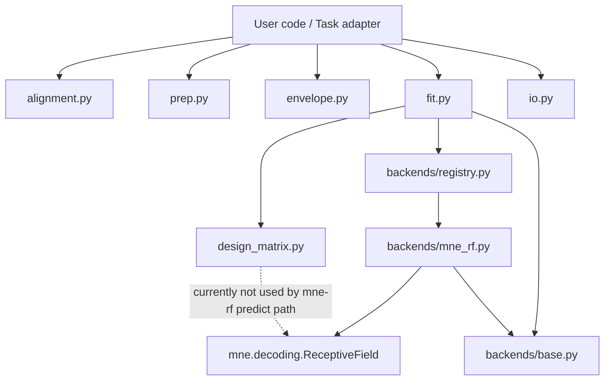

# DCAP TRF subpackage (current state) — overview + refactor notes

This subpackage implements a **thin TRF abstraction layer** with a single backend today: **MNE’s `mne.decoding.ReceptiveField`** (registered as `"mne-rf"`). The goal is to keep a stable, testable front-end while allowing different backends later.

---

## Mental model (what lives where)

### Public-ish core utilities
- **Alignment**: align signals on a common sample timeline (`alignment.py`)【3:3†alignment.py†L39-L90】
- **Array prep**: resample/crop/stack runs into epoched arrays (`prep.py`)【3:6†prep.py†L1-L10】【3:1†prep.py†L40-L76】
- **Design matrix**: explicit lagged design matrix builder (currently standalone; not used by the MNE backend) (`design_matrix.py`)【4:3†design_matrix.py†L1-L12】【4:15†design_matrix.py†L1-L24】
- **Fit & predict**: backend dispatch + ridge convenience + ridge CV (`fit.py`)【3:9†fit.py†L23-L41】【3:10†fit.py†L5-L47】
- **Persistence**: save/load results (`io.py`)【3:8†io.py†L23-L65】【3:8†io.py†L67-L113】

### Backend layer
- **Backend interface** (`backends/base.py`) defines `TrfBackend.fit/predict` and `BackendFitResult`【4:2†base.py†L11-L33】【4:2†base.py†L35-L52】
- **Backend registry** (`backends/registry.py`) maps `"mne-rf"` → `MneReceptiveFieldBackend()`【4:9†registry.py†L56-L58】【4:9†registry.py†L61-L93】
- **MNE backend wrapper** (`backends/mne_rf.py`) delegates to MNE, stores the fitted estimator inside `extra["estimator"]`【4:7†mne_rf.py†L83-L88】

---

## Dependency diagram (how the pieces connect)



Key practical implication:
- The `"mne-rf"` backend **does not use** `design_matrix.build_lagged_design_matrix`; MNE builds its own internal lagging. That’s why `extra["estimator"]` is required for prediction【4:7†mne_rf.py†L83-L88】.

---

## Minimal “MNE-like” example (continuous + epoched)

### Continuous TRF (single run)
```python
import numpy as np
from dcap.analysis.trf.design_matrix import LagConfig  # current file defines ms-based config
from dcap.analysis.trf.fit import fit_trf, predict_trf
from dcap.analysis.trf.types import TrfFitConfig

sfreq = 100.0
n_times, n_features, n_outputs = 10_000, 1, 16

X = np.random.randn(n_times, n_features)
Y = np.random.randn(n_times, n_outputs)

lags = LagConfig(tmin_ms=-100, tmax_ms=400, step_ms=10, mode="valid")
fit = fit_trf(X, Y, sfreq=sfreq, lag_config=lags, fit_config=TrfFitConfig(
    backend="mne-rf",
    backend_params={"alpha": 10.0},
))
Y_hat = predict_trf(X, fit)
```

### Epoched TRF (multiple runs / leave-one-run-out CV)
Epoched convention is **(time, epoch, feature/output)** (epoch ≈ run)【3:10†fit.py†L18-L26】.

```python
import numpy as np
from dcap.analysis.trf.fit import fit_trf_ridge_cv, fit_trf_ridge, predict_trf
from dcap.analysis.trf.design_matrix import LagConfig

sfreq = 100.0
n_times, n_epochs, n_features, n_outputs = 20_000, 4, 1, 16

X = np.random.randn(n_times, n_epochs, n_features)
Y = np.random.randn(n_times, n_epochs, n_outputs)

lags = LagConfig(tmin_ms=-100, tmax_ms=400, step_ms=10, mode="valid")

cv = fit_trf_ridge_cv(
    X, Y,
    sfreq=sfreq,
    lag_config=lags,
    alphas=[0.1, 1.0, 10.0, 100.0],
    alpha_mode="shared",      # or "per_channel"
    score_agg="mean",         # or "median"
)

# Then refit using the chosen alpha:
fit = fit_trf_ridge(X, Y, sfreq=sfreq, lag_config=lags, alpha=cv.best_alpha)
Y_hat = predict_trf(X, fit)
```

---

## How cross-validation works today (and what’s missing)

### ✅ Implemented: alpha selection by leave-one-epoch-out CV
`fit_trf_ridge_cv(...)`:
- Requires epoched arrays (X,Y are 3D)【3:10†fit.py†L56-L59】
- Performs **leave-one-epoch-out** (fold = held-out epoch)【3:10†fit.py†L83-L87】
- For each fold and each alpha:
  1) fit on training epochs (using `fit_trf_ridge`)  
  2) predict on held-out epoch (using `predict_trf`)  
  3) compute **Pearson correlation per output** on the held-out epoch and aggregate across outputs for shared-alpha mode【4:13†fit.py†L1-L12】【4:13†fit.py†L13-L28】

Important: **scoring is hard-coded to Pearson correlation**【3:10†fit.py†L46-L47】.

### ❌ Not implemented: “nested CV”
There is no outer CV loop that would:
- choose alpha on inner folds, then
- evaluate generalization on a *separate* held-out outer fold.

Right now, the main “CV” is used only for **alpha selection**, and you’d still need to implement your own evaluation split logic around it (or add it to the API).

---

## Current API rough edges (what’s making it hard to read/use)

### 1) Duplicate/conflicting “types”
There are **two separate `EnvelopeConfig` and `LagConfig` classes**:
- `dcap.analysis.trf.types` defines `EnvelopeConfig` + `LagConfig` in **seconds-based** form (`tmin_s/tmax_s`)【3:7†types.py†L27-L63】
- `envelope.py` defines a different `EnvelopeConfig` (power-law only)【3:14†envelope.py†L24-L40】
- `design_matrix.py` defines a different `LagConfig` in **milliseconds** (`tmin_ms/tmax_ms/step_ms`)【4:3†design_matrix.py†L30-L52】

This creates confusion, and it’s currently easy to import the “wrong” config.

### 2) Two result containers with different intent
- `types.TrfResult` is meant as a persistent “weights/lags/metrics/metadata” container【3:7†types.py†L83-L119】
- `fit.py` returns `TrfFitResult` / `TrfRidgeCvResult` (not shown in the snippets above, but used throughout `fit.py`)【4:12†fit.py†L16-L23】

This split is fine, but it needs clearer “when to use which” docs and ideally explicit converters.

### 3) Scoring is buried and fixed
The CV code explicitly says scoring uses Pearson correlation【3:10†fit.py†L46-L47】, and there is no wrapper-level scoring API.

---

## Refactor suggestions (minimal but high-leverage)

### A) Create a single top-level, MNE-like facade: `TemporalReceptiveField`
Add `dcap.analysis.trf.api` with a class like:

- `fit(X, Y, *, sfreq, lags, alpha | alphas, cv="loo" | None, scoring="pearson" | "r2" | "spearman")`
- `predict(X)`
- `score(X, Y, scoring=...)`
- `get_coef()` / `get_lags()` (optional)

This does two things:
1) Provides an intuitive “front door” like MNE’s `ReceptiveField`.
2) Centralizes cross-validation and scoring so backend configs stay backend-y.

### B) Centralize scoring in one module and add Spearman at the wrapper level
Create `dcap.analysis.trf.metrics`:

- `pearsonr_per_channel(y, y_hat)` (already exists internally as `_corr_per_channel`)【4:10†fit.py†L73-L91】
- `r2_per_channel(y, y_hat)`
- `spearmanr_per_channel(y, y_hat)` (wrapper-level; no backend needed)

Then:
- `fit_trf_ridge_cv(..., scoring="pearson" | "r2" | "spearman")`
- store metric name + values in `TrfRidgeCvResult` (and potentially in persisted `TrfResult.metrics`).

**Implementation note:** Spearman is just Pearson on ranks:
- For each channel: `rho = corr(rank(y), rank(y_hat))`
- Compute ranks with `scipy.stats.rankdata` along time.

### C) Make CV explicit and extensible
Introduce a small CV config:

```python
@dataclass(frozen=True)
class CvConfig:
    scheme: Literal["loo_epoch", "kfold_epoch"]
    n_splits: int = 5
    shuffle: bool = False
    random_state: int | None = None

@dataclass(frozen=True)
class NestedCvConfig:
    outer: CvConfig
    inner: CvConfig
```

Then add:
- `select_alpha_cv(X, Y, alphas, cv=...)`  (current functionality)
- `evaluate_nested_cv(X, Y, alphas, nested_cv=...)` (new)
  - Outer split over epochs
  - Inner CV chooses alpha using training folds
  - Refit on full outer-train with chosen alpha
  - Score on outer-test

### D) Unify configs (remove duplicates)
Pick **one** canonical config module (probably `types.py`) and:
- Move ms-based lag config there (or keep seconds-based but be consistent).
- Delete or deprecate the duplicates in `envelope.py` and `design_matrix.py`, or make them re-export the canonical types.

If you want to preserve ms ergonomics:
- store `tmin_s/tmax_s/step_s` internally
- expose convenience constructors `LagConfig.from_ms(...)`

### E) Clarify “design_matrix.py” role
Right now it’s a parallel TRF implementation (explicit lagging) that isn’t used by the MNE backend. You have two options:

1) **Make it the reference implementation** for backends that operate on explicit X-lag matrices (e.g., sklearn Ridge), and keep `"mne-rf"` as an alternative backend.
2) **Keep it as a utility** for analyses where you want explicit X and explicit alignment (`row_indices` are very useful)【4:15†design_matrix.py†L9-L11】—but document clearly that MNE backend ignores it.

---

## A concrete “v1 wrapper API” proposal (tiny surface area)

- `fit_trf(...)` stays as low-level backend dispatch.
- Add new wrapper functions:
  - `fit_trf_auto(...)`:
    - if `alphas` is provided → run CV → refit using best alpha
    - else use `alpha` directly
    - accepts `scoring="pearson"|"r2"|"spearman"`
  - `score_trf(Y, Y_hat, scoring=...)` and/or `score_trf_model(X, Y, fit, scoring=...)`

That’s enough to:
- make the package readable,
- make scoring consistent,
- and add Spearman without touching backends.

---

## Quick checklist for next steps

1) **Pick a single canonical LagConfig + EnvelopeConfig** (kill duplicates).
2) Add `metrics.py` with pearson/r2/spearman per-channel + aggregation helpers.
3) Extend `fit_trf_ridge_cv(..., scoring=...)` and store metric name in results.
4) Add `fit_trf_auto(...)` that does “CV then refit”.
5) Optional but recommended: add `nested_cv` evaluation to prevent optimistic selection bias.

---

## Appendix: what CV is currently optimizing

In current `fit_trf_ridge_cv`, the objective is:

For each alpha \(a\), each fold \(f\) (held-out epoch), compute per-channel Pearson:

\[
r_{a,f,c} = \mathrm{corr}\left(y_{f,c}(t), \hat{y}_{a,f,c}(t)\right)
\]

Then aggregate across channels (shared-alpha mode), e.g. mean:

\[
s_{a,f} = \frac{1}{C}\sum_{c=1}^C r_{a,f,c}
\qquad
\bar{s}_a = \frac{1}{F}\sum_{f=1}^F s_{a,f}
\]

Select:

\[
a^\* = \arg\max_a \bar{s}_a
\]

This is explicitly stated in the docstring (“Pearson correlation per channel … then aggregates”)【3:10†fit.py†L46-L47】 and implemented in the fold loop【4:13†fit.py†L5-L12】.
