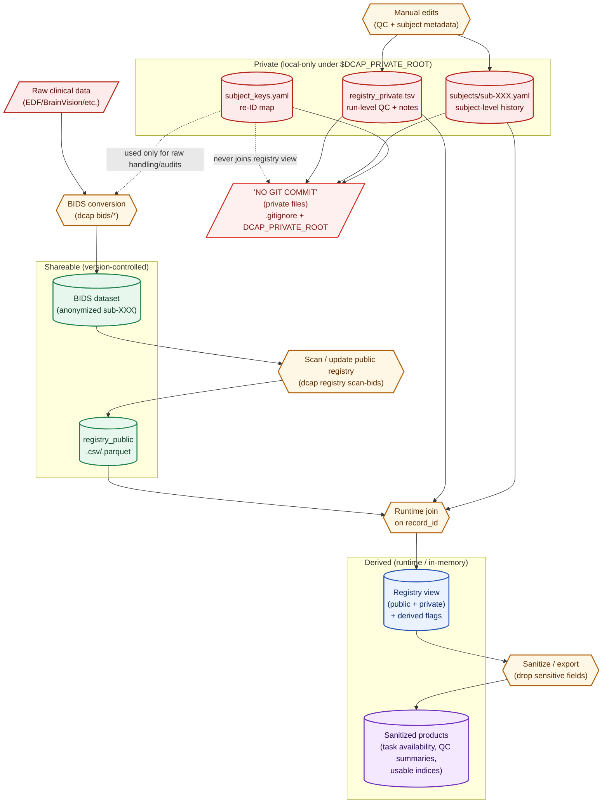

# Private Metadata & Privacy Workflow (dcap)

This document describes **how new data are registered**, **how privacy is enforced**, and **how private and public metadata interact** in `dcap`.

The core design principle is **strict separation between shareable data and sensitive metadata**, with explicit, auditable joins performed only at runtime.

---

## 1. What an experimenter must do when new data are acquired

When new data are acquired, the experimenter performs **three explicit steps**.

### Step 1 — Convert raw data to BIDS (shareable)

- Raw clinical recordings are converted into a **BIDS-compliant dataset** using `dcap` converters.
- The BIDS dataset:
  - uses anonymized subject IDs (`sub-XXX`)
  - encodes task / session / run structure
  - contains **no direct identifiers** (names, dates of birth, MRNs, etc.)

This dataset is safe to share internally and externally.

### Step 2 — Update the public registry (shareable)

- A **public registry** (`registry_public.csv` or `.parquet`) is generated or updated.
- Each row corresponds to a single data unit:

```
(subject, session, task, run, datatype)
```

- Each row is assigned a **stable record identifier**:

```
record_id = {dataset_id}|{subject}|{session}|{task}|{run}|{datatype}
```

- The public registry contains:
  - dataset structure
  - BIDS identifiers
  - file existence information
- The public registry contains **no sensitive metadata** and is version controlled.

### Step 3 — Update private metadata (local, manual)

The experimenter updates **local private metadata** stored outside the repository under:

```
$DCAP_PRIVATE_ROOT/
```

This includes:
- run-level QC decisions
- subject-level clinical and acquisition context

These files are **never committed**.

---

## 2. Privacy model

`dcap` uses a **three-layer metadata model**.

### Layer 1 — Public (shareable)
- BIDS dataset
- Public registry (`registry_public`)
- Safe to commit and distribute
- No direct or indirect identifiers

### Layer 2 — Private (local only)
Stored under `$DCAP_PRIVATE_ROOT`.

Contains:
- subject re-identification keys
- dates of birth
- acquisition dates and locations
- medication history
- clinical notes
- QC rationales

These files are:
- user-managed
- excluded from Git
- never loaded implicitly

### Layer 3 — Derived / sanitized views
- Generated **at runtime** by joining public + private layers
- Used internally for analysis and workflow decisions
- Never written back to disk unless explicitly sanitized

---

## 3. How private data are transformed into sanitized data

Private metadata are **never exported directly**.

Instead:

1. Public and private metadata are joined in memory using `record_id`.
2. Derived fields are computed (e.g. `is_usable`, `effective_qc_status`).
3. A **sanitization step** explicitly removes all sensitive fields.

Sanitized outputs may include:
- task availability summaries
- usable run indices
- anonymized QC status

Sanitized outputs **cannot** contain:
- names
- dates of birth
- acquisition dates
- medication details
- free-text private notes

Sanitization is explicit, auditable, and reproducible.

---

## 4. How files are linked (TSV, YAML, registry)

### Public registry (shareable)

**File**
```
registry_public.csv / registry_public.parquet
```

**Role**
- Canonical inventory of what data exist
- Defines `record_id`

**Key**
```
record_id
```

### Private run-level registry (local)

**File**
```
$DCAP_PRIVATE_ROOT/registry_private.tsv
```

**Role**
- Run-level QC decisions
- Exclusion flags
- Private notes

**Key**
```
record_id  ← joins to public registry
```

### Private subject-level metadata (local)

**Files**
```
$DCAP_PRIVATE_ROOT/subjects/sub-XXX.yaml
```

**Role**
- Subject identity (private)
- Acquisition history
- Medication history
- Protocol descriptions

**Key**
```
subject (sub-XXX)
```

These files are **subject-centric**, not run-centric.

### Subject re-identification map (local)

**File**
```
$DCAP_PRIVATE_ROOT/subject_keys.yaml
```

**Role**
- Maps `sub-XXX` ↔ local clinical identifiers
- Used only for raw data handling and audits

This file is never merged into registries or analysis views.

---

## 5. Workflow diagram (Mermaid)

> **Legend**
> - **Green** = shareable / version-controlled
> - **Red** = private / never committed
> - **Blue** = derived in-memory view
> - **Purple** = sanitized outputs safe to share



---

## 6. Summary

- **Public files define what exists**
- **Private files define context and decisions**
- **Joins are explicit, local, and temporary**
- **Sanitization is mandatory for sharing**

This separation allows `dcap` to support real clinical workflows without compromising privacy or reproducibility.

TODO:
```bash
export DCAP_PRIVATE_ROOT="/path/to/private/directory"
```
